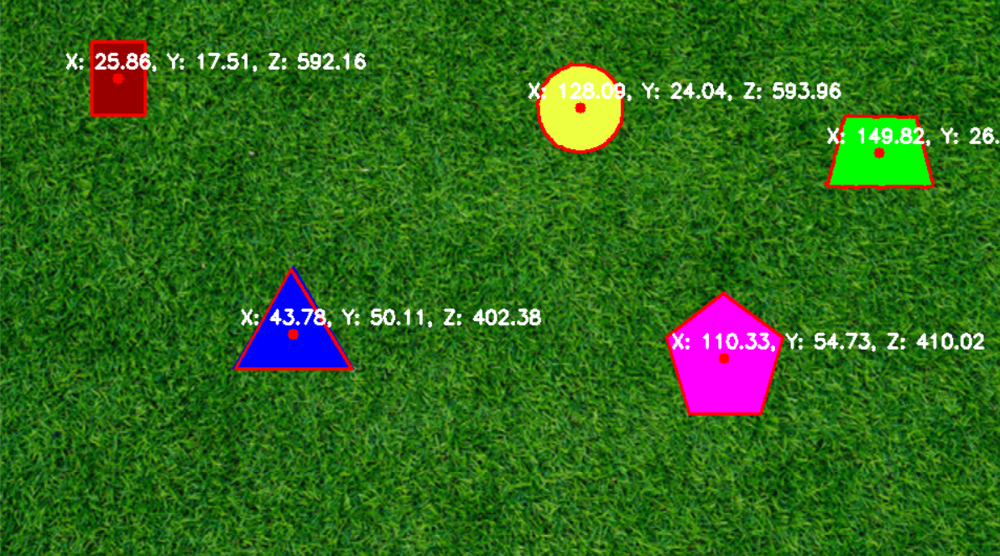

# Hello! This is my PennAiR Technical Challenge!

## Task 1
You can see my results for Task 1 below!

You can additionally see the results of Task 4 on the picture where I calculated the distance using the intrinsic matrix.

In order to do this, all of the work is located in ImageDetection.py, I started by grayscaling the image, then using a threshold to make the image a binary. Over this I found the contours and drew some edges.
However, this ran into an issue where some shapes became black along with the background, thus there were no contours to find. As a result I decided to create functions to find red hues, blue hues, and tan hues.

## Task 2
Not much changed here, I didn't change my algorithm at all. I just applied it frame by frame. You can see the results [here](https://youtu.be/Ff8hz7aU5DQ)

## Task 3
This task was very hard and as you will see in the example it did not work perfectly. You can see the results [here](https://youtu.be/h4JRnVxo6q0). I failed to identify the blue/yellow shape as one shape and my algorithm identified the blue and yellow part seperately. Additionally my algorithm did not deal with overlapping shapes as well as it did in part 2. For this task I tried many things. However, the result that gave me the best result was subtracting a pure white picture from the original picture. I got the inspiration from astronomy where they take flats of the telescope to subtract out noise from the telescope in an image. I used a random picture of static I found on the internet, a screenshot of a section of the background of the test video. But what I found worked best was a plain white image. I then used techniques from task1 and 2 in order to identify the shapes.

## Task 4
This task was not too bad, I just updated each function with the information regarding distance. Sometimes there are overlapping numbers on the same shape, because in my implementation, sometimes shapes are identified by different algorithms and thus marked twice.

## Running
To run the code clone the repo and you can run each file in your terminal!

## Overall Thoughts
This was my first real experience with Computer Vision. It was quite hard and I tried many different things before I had something that even remotely worked, but it was quite fun. The old attempts may not run properly due to some refactoring, but they are there for your enjoyment I suppose.
